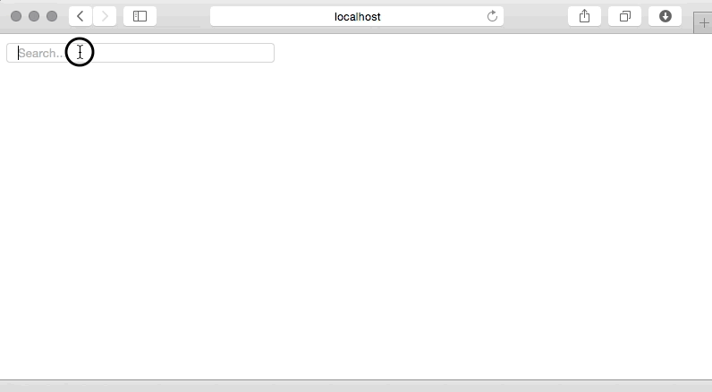

# Micro Ajax Autocomplete

A minimal, AJAX autocomplete with no dependencies.

Only 2kb minified.

Tested with:

* Chrome
* Safari
* Safari iOS

Works with:

* Mouse
* Keyboard (arrow keys for selection)



## Example

```
<input type="search" id="autocomplete" placeholder="Search...">
```

Initial search input:

```
new Autocomplete(document.getElementById('autocomplete'), { 
	url: '/api', 
	param: 's',
	label: 'title',
	select: function(item) {
		// Do something with the selected item...
		console.log(item);
	}
});
```

## See it working

Clone the repository.

Run:

```
npm install
npm start
```

Navigate to:

http://localhost:3000/index.html

## Blog Post

Accompanying blog post detailing how Karma was used for testing across multiple browsers. [Creating an AJAX Autocomplete](http://www.bradoncode.com/blog/2015/03/26/javascript-ajax-autocomplete/)
